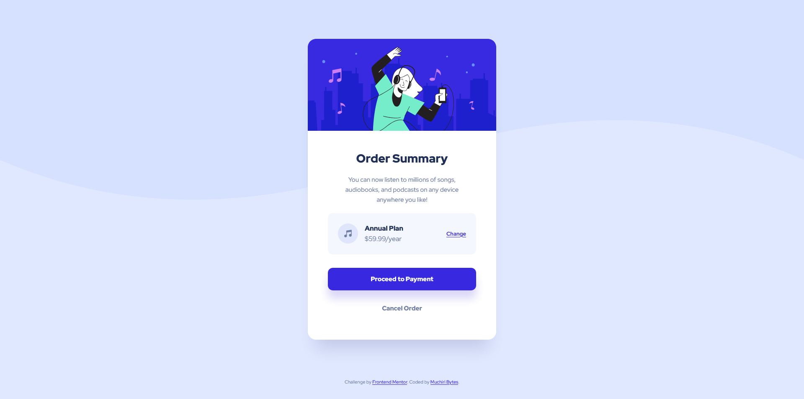

# Frontend Mentor - Order summary card solution

This is a solution to the [Order summary card challenge on Frontend Mentor](https://www.frontendmentor.io/challenges/order-summary-component-QlPmajDUj).

## Table of contents

- [Overview](#overview)
  - [The challenge](#the-challenge)
  - [Screenshot](#screenshot)
  - [Links](#links)
- [My process](#my-process)
  - [Built with](#built-with)
  - [What I learned](#what-i-learned)
  - [Continued development](#continued-development)
  - [Useful resources](#useful-resources)
- [Author](#author)

## Overview

### The challenge

Users should be able to:

- See hover states for interactive elements
- Experience a responsive layout optimized for mobile and desktop screens

### Screenshot



### Links

- Solution URL: [https://github.com/muchiribytes/order-summary-component](https://github.com/muchiribytes/order-summary-component)
- Live Site URL: [https://muchiribytes.github.io/order-summary-component/](https://muchiribytes.github.io/order-summary-component/)

## My process

### Built with

- Semantic HTML5 markup
- CSS custom properties (Variables)
- Modern CSS logical properties (`inline-size`, `margin-block-end`, `padding-inline`)
- BEM (Block Element Modifier) methodology
- CSS Grid & Flexbox
- Mobile-first workflow
- Clamp / REM relative units

### What I learned

During this project, I focused on precision text line wrapping across viewports without relying on `<span>` or `<br>` tags[cite: 1, 2, 3]. By utilizing `max-inline-size` alongside responsive container paddings, the browser engine naturally wraps lines at exact word boundaries matching the design mockups[cite: 1, 2, 3].

```css
.card__description {
  font-size: 0.9375rem;
  line-height: 1.6;
  color: var(--color-gray-600);
  margin-block-end: 1.5rem;
  margin-inline: auto;

  /* Mobile: forces line break after "of" and "on" */
  max-inline-size: 16rem;
}

@media (min-width: 30em) {
  .card__description {
    font-size: 0.9375rem;
    margin-block-end: 1.25rem;

    /* Desktop: forces line break after "songs," and "device" */
    max-inline-size: 19rem;
  }
}
```

I also learned how to scale and position SVG background patterns cleanly on wide viewports using CSS background properties:

```css
@media (min-width: 48em) {
  .page-body {
    background-image: url("./images/pattern-background-desktop.svg");
    background-size: 100% 50vh;
    background-position: top left;
  }
}
```

### Continued development

In upcoming projects, I want to continue refining:

- Advanced accessibility patterns (WCAG AAA focus rings and screen-reader testing).

- Fluid typography and layout scaling using advanced CSS math functions.

- Automated commit workflows using Git hooks.

### Useful resources

- [MDN Web Docs - CSS Logical Properties](https://developer.mozilla.org/en-US/docs/Web/CSS/CSS_Logical_Properties) - Essential guide for adopting modern logical layout properties.
- [A Complete Guide to Flexbox](https://css-tricks.com/snippets/css/a-guide-to-flexbox/) - Useful reference for alignment inside the plan selection box.

## Author

- Frontend Mentor - [@MuchiriBytes](https://www.frontendmentor.io/profile/muchiribytes)
- Twitter - [MuchiriBytes](https://x.com/muchiribytes)
